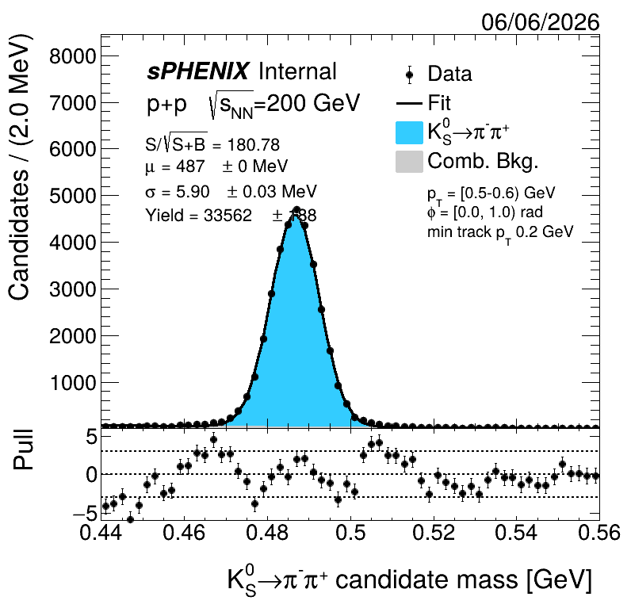
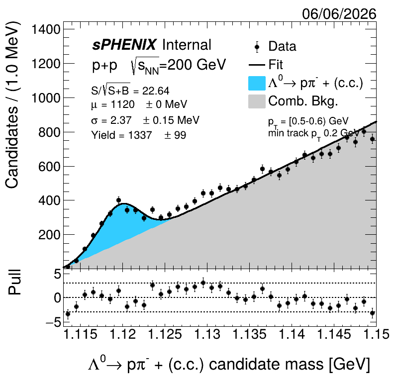

### Remember to change directory names to your designated place

Example output of the fit result to the Kshort candidate distribution

Example output of the fit result to the Lambda candidate distribution

Updated: 2026.06.08 by Hao-Ren Jheng